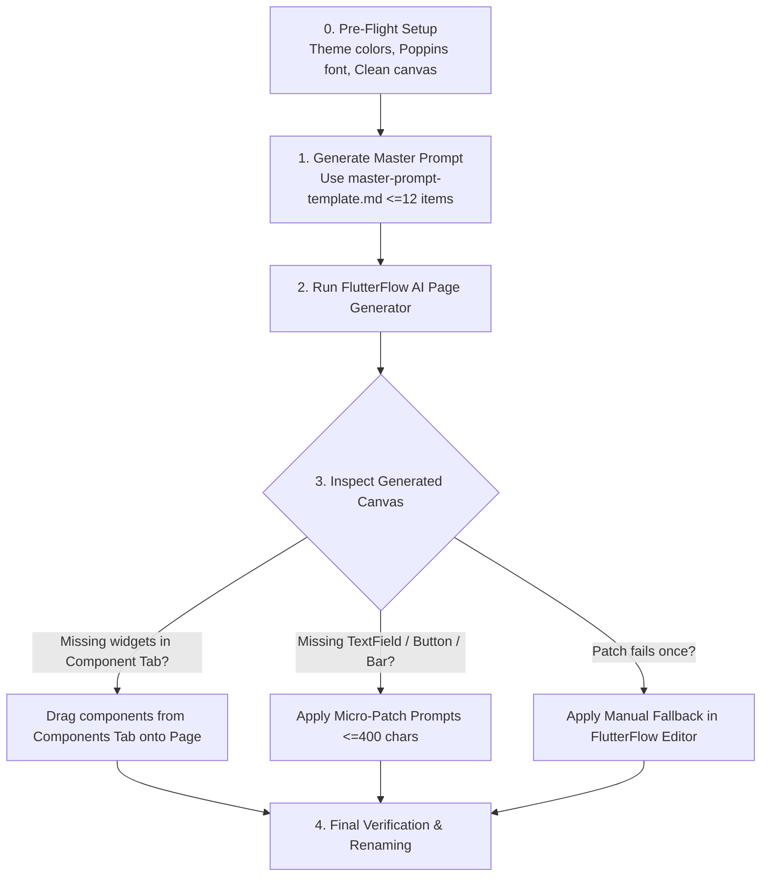

# FlutterFlow Page Prompts Skill 🚀

A comprehensive, battle-tested prompt engineering framework and automated self-correction skill designed specifically for **FlutterFlow "Generate with AI" (Page mode)**.

This repository provides prompt recipes, failure diagnostics, verify-and-patch loops, and manual fallback guides to solve common FlutterFlow GenAI limitations (e.g., dropped `TextField`s, missing primary `Button`s, blurry components, nested column bugs, and missing navigation bars).

---

## 📑 Table of Contents

- [Overview & Problem Statement](#-overview--problem-statement)
- [Evolution Matrix & Skill Levels (0 to 6)](#-evolution-matrix--skill-levels-0-to-6)
- [Detailed Level Breakdown & Differences](#-detailed-level-breakdown--differences)
- [Repository Structure](#-repository-structure)
- [How to Use the Skill](#-how-to-use-the-skill)
- [Core Workflow](#-core-workflow)
- [Reference Documents](#-reference-documents)
- [License & Contributions](#-license--contributions)

---

## 🎯 Overview & Problem Statement

FlutterFlow's AI page generator excels at rendering static layouts (text elements, cards, stylized containers, images, and list views) but frequently drops or misplaces interactive widgets such as:
1. **Interactive Inputs**: Form `TextField`s omitted or rendered as flat text.
2. **Action Buttons**: Floating or footer `Button`s disappearing or hidden inside sub-components.
3. **Navigation Bars**: Custom app bars or floating bottom nav bars dropped.
4. **Auto-Component Isolation**: FlutterFlow AI quietly generating missing widgets into the *Components* tab instead of placing them directly on the active canvas.

This repository provides progressive skill packages (`.skill`) and unbundled reference guides that enforce a strict **Prompt -> Verify -> Patch -> Fallback** lifecycle to achieve 100% functional screens.

---

## 📊 Evolution Matrix & Skill Levels (0 to 6)

| Level | File Name | Size | References Included | Primary Focus / Milestone |
|---|---|---|---|---|
| **Level 0 (v1.0)** | [`packages/flutterflow-page-prompts-v1.0-foundation.skill`](packages/flutterflow-page-prompts-v1.0-foundation.skill) | ~9.1 KB | 4 files | **Foundation**: Core AI page prompt rules, basic error patching, initial FoodDi experiment logs. |
| **Level 1 (v1.1)** | [`packages/flutterflow-page-prompts-v1.1-extended-diagnostics.skill`](packages/flutterflow-page-prompts-v1.1-extended-diagnostics.skill) | ~11.0 KB | 4 files | **Extended Diagnostics**: Expanded empirical failure patterns (container nesting, clipping) in `what-works.md`. |
| **Level 2 (v1.2)** | [`packages/flutterflow-page-prompts-v1.2-multi-attempt-fallbacks.skill`](packages/flutterflow-page-prompts-v1.2-multi-attempt-fallbacks.skill) | ~12.1 KB | 4 files | **Fallbacks & Multi-Run Data**: Step-by-step widget tree manual fixes and multi-attempt comparative tables. |
| **Level 3 (v1.3)** | [`packages/flutterflow-page-prompts-v1.3-layout-rules.skill`](packages/flutterflow-page-prompts-v1.3-layout-rules.skill) | ~12.6 KB | 4 files | **Layout & Structural Constraints**: Strict Column/Row nesting limits, padding bounds, token-optimized templating. |
| **Level 4 (v1.4)** | [`packages/flutterflow-page-prompts-v1.4-known-good-library.skill`](packages/flutterflow-page-prompts-v1.4-known-good-library.skill) | ~14.4 KB | 5 files | **Known-Good Prompts**: Introduced `known-good-prompts.md` library with verified baseline templates (Burger Bros, Auth). |
| **Level 5 (v1.5)** | [`packages/flutterflow-page-prompts-v1.5-ecommerce-complex.skill`](packages/flutterflow-page-prompts-v1.5-ecommerce-complex.skill) | ~16.4 KB | 5 files | **E-Commerce & Component Tab**: Added "Step 0 Component Tab" checks, multi-item checkout flows, and cart screen patterns. |
| **Level 6 (v1.6)** | [`packages/flutterflow-page-prompts-v1.6-master-latest.skill`](packages/flutterflow-page-prompts-v1.6-master-latest.skill) | ~16.7 KB | 5 files | **Production Master (Latest)**: Complete benchmark library, full multi-screen recipes (Auth, Food Delivery, Cart, Profile), refined diagnostics. |

---

## 🔍 Detailed Level Breakdown & Differences

### Level 0 — Base Foundation (`v1.0.0`)
- **Core Concept**: Initial framework for writing 1-prompt = 1-page instructions.
- **Includes**:
  - `SKILL.md` (81 lines): Basic workflow definition.
  - `master-prompt-template.md`: Structured placeholder format.
  - `fix-prompts.md`: First set of follow-up patch prompts.
  - `manual-fallbacks.md`: Basic recovery when AI fails.
  - `what-works.md` (93 lines): Baseline evidence from real generation attempts.

### Level 1 — Extended Diagnostics (`v1.1.0`)
- **Key Enhancements**:
  - Expanded `what-works.md` from 93 to 134 lines with observed failure modes (e.g. nested containers breaking responsiveness, dropped action bars).
  - Enhanced verification checklist to prevent multiple repeated failed AI runs.

### Level 2 — Multi-Attempt Catalog & Advanced Fallbacks (`v1.2.0`)
- **Key Enhancements**:
  - Expanded `manual-fallbacks.md` to 62 lines, detailing step-by-step visual widget tree reconstruction.
  - Expanded `what-works.md` to 163 lines with comprehensive cross-attempt comparison tables.

### Level 3 — Layout Constraints & Rule Refinement (`v1.3.0`)
- **Key Enhancements**:
  - Refined `master-prompt-template.md` with explicit column/row hierarchy constraints.
  - Strict numbering rules (max 12 structural items per generation) to prevent token overflow.

### Level 4 — Modular Library & Known-Good Baselines (`v1.4.0`)
- **Key Enhancements**:
  - Introduced new dedicated reference: `references/known-good-prompts.md`.
  - Added battle-tested baseline prompts (e.g., Burger Bros authentication screens with 9/11 widget hit rate).
  - Separated baseline prompt catalog from generic templates.

### Level 5 — E-Commerce Patterns & "Step 0" Component Checks (`v1.5.0`)
- **Key Enhancements**:
  - Added critical **Step 0 Diagnostics**: Checks if FlutterFlow created missing widgets inside the "Components" tab.
  - Expanded `fix-prompts.md` for single-target micro-patches.
  - Added complex food delivery, cart, and checkout screen patterns in `what-works.md` (219 lines).

### Level 6 — Master Production Benchmark Library (`v1.6.0` - Current)
- **Key Enhancements**:
  - **Full Production Suite**: Comprehensive prompts spanning Auth, Product Listings, Food Delivery Detail, Cart & Checkout, Profile & Settings.
  - **Complete Patch Catalog**: Targeted micro-prompts under 400 characters for instantaneous UI patching.
  - **Exhaustive Evidence Log**: Detailed empirical analysis of what FlutterFlow AI supports natively versus what requires manual finishing.

---

## 📁 Repository Structure

```
flutterflow-page-prompts/
├── .gitignore
├── README.md
├── packages/                                             # Pre-packaged .skill zip bundles by version
│   ├── flutterflow-page-prompts-v1.0-foundation.skill
│   ├── flutterflow-page-prompts-v1.1-extended-diagnostics.skill
│   ├── flutterflow-page-prompts-v1.2-multi-attempt-fallbacks.skill
│   ├── flutterflow-page-prompts-v1.3-layout-rules.skill
│   ├── flutterflow-page-prompts-v1.4-known-good-library.skill
│   ├── flutterflow-page-prompts-v1.5-ecommerce-complex.skill
│   └── flutterflow-page-prompts-v1.6-master-latest.skill # Latest complete bundle
└── skills/
    └── flutterflow-page-prompts/                         # Latest uncompressed skill source (v1.6)
        ├── SKILL.md                                      # Core skill orchestrator & rules
        └── references/
            ├── fix-prompts.md                            # Targeted micro-patches
            ├── known-good-prompts.md                     # Proven, high-accuracy prompts
            ├── manual-fallbacks.md                       # FlutterFlow visual editor workarounds
            ├── master-prompt-template.md                 # Universal generation template
            └── what-works.md                             # Empirical research & failure log
```

---

## ⚡ How to Use the Skill

### 1. In Antigravity / Gemini CLI Agent
Copy the latest unbundled skill directory directly into your workspace or global configuration:
```bash
# In your workspace root:
mkdir -p .agents/skills
cp -r skills/flutterflow-page-prompts .agents/skills/

# Or install globally:
mkdir -p ~/.gemini/config/skills
cp -r skills/flutterflow-page-prompts ~/.gemini/config/skills/
```

### 2. In Claude Code / Cursor / Windsurf
Import the skill folder or copy `skills/flutterflow-page-prompts/SKILL.md` into your custom instructions / agent rules.

### 3. Manual FlutterFlow Development
Browse [`skills/flutterflow-page-prompts/references/`](skills/flutterflow-page-prompts/references/):
1. Copy a template from [`master-prompt-template.md`](skills/flutterflow-page-prompts/references/master-prompt-template.md) or [`known-good-prompts.md`](skills/flutterflow-page-prompts/references/known-good-prompts.md).
2. Paste into FlutterFlow's **Generate with AI (Page mode)**.
3. If widgets are missing, apply micro-patches from [`fix-prompts.md`](skills/flutterflow-page-prompts/references/fix-prompts.md).

---

## 🔄 Core Workflow



---

## 📚 Reference Documents

- **[`SKILL.md`](skills/flutterflow-page-prompts/SKILL.md)**: Main instruction orchestrator and prompt guidelines.
- **[`master-prompt-template.md`](skills/flutterflow-page-prompts/references/master-prompt-template.md)**: Standardized template with strict widget hierarchies.
- **[`fix-prompts.md`](skills/flutterflow-page-prompts/references/fix-prompts.md)**: Single-target patch prompts for quick fixes.
- **[`known-good-prompts.md`](skills/flutterflow-page-prompts/references/known-good-prompts.md)**: Curated list of high-accuracy baseline prompts.
- **[`what-works.md`](skills/flutterflow-page-prompts/references/what-works.md)**: Empirical test logs, failure mode matrix, and capabilities guide.
- **[`manual-fallbacks.md`](skills/flutterflow-page-prompts/references/manual-fallbacks.md)**: Step-by-step visual editor fallbacks.

---

## 📄 License & Contributing

Contributions, additional verified prompts, and failure log observations are welcome! Feel free to open an issue or submit a pull request with new test cases.
